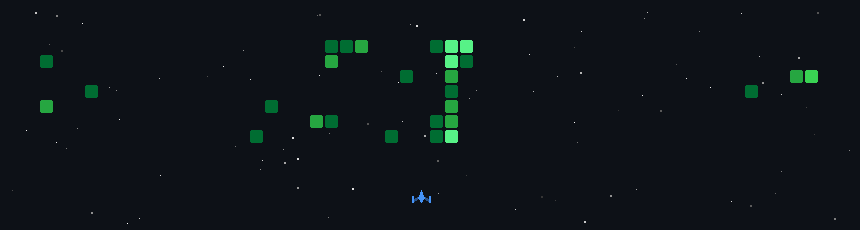

# 💫 About Me:
A motivated final-year Software Engineering student at TAR UMT with a strong interest in web and software development. Experienced in Agile-based projects, RESTful API integration, and frontend development using React.js. Actively involved in an industry-level fingerprint-scanning web application for a DMIT system. Eager to contribute as a software engineering intern while gaining hands-on experience in real-world systems.

  

## 🌐 Socials:
 

# 💻 Tech Stack:
                                                           
# 📊 GitHub Stats:
 
 

## 🏆 GitHub Trophies

### ✍️ Random Dev Quote

### 🔝 Top Contributed Repo

### 💰 Support Me
 

<!-- Proudly created with GPRM ( https://gprm.itsvg.in ) -->
