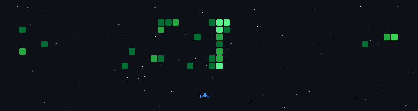

    

    

        
        
    

# About Me 

  A motivated final-year Software Engineering student at TAR UMT with a strong interest in web and software development. Experienced in Agile-based projects, RESTful API integration, and frontend development using React.js. Actively involved in an industry-level fingerprint-scanning web application for a DMIT system. Eager to contribute as a software engineering intern while gaining hands-on experience in real-world systems.

 

    

<!-- 

  

 -->

## Connect with Me

  

## Tech Stack

  ### Programming Languages
  
  
  
  
  
  
  
  
  
    
  ### Frontend Development
  
  
  
  
  
  
  
    
  ### Mobile Development
  
  
  
    
  ### Backend Development
  
  
  
  
    
  ### Cloud & DevOps
  
  
  
  
    
  ### Databases
  
  
  
  
    
  ### AI / Data Science
  
  
  
  
  
  
    
  ### Design & UI Tools
  
  
  
  
    
  ### Development Tools
  
  
  
  
  
  
  
    
  ### Graphics / Game Development
  
  
  
  
    
  ### Miscellaneous Tools
  
  

## GitHub Stats:

    
  
  
   
  

## Activity Graph

<!-- 
  ## GitHub Trophies

 -->

### Quote of the Day

  

<!-- 
  ### Top Contributed Repo
  
 -->

### Support Me

  
  

<!-- Proudly created with GPRM ( https://gprm.itsvg.in ) -->

